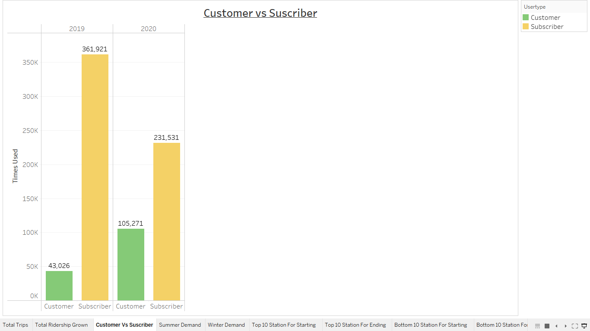

# 
<u>Citi Bike Analytics</u>

 

### <u>Background</u>

 

Congratulations on your new job! As the new lead analyst for the [New York Citi Bike](https://en.wikipedia.org/wiki/Citi_Bike) Program, you are now responsible for overseeing the largest bike sharing program in the United States. In your new role, you will be expected to generate regular reports for city officials looking to publicize and improve the city program.

Since 2013, the Citi Bike Program has implemented a robust infrastructure for collecting data on the program's utilization. Through the team's efforts, each month bike data is collected, organized, and made public on the [Citi Bike Data](https://www.citibikenyc.com/system-data) webpage.

However, while the data has been regularly updated, the team has yet to implement a dashboard or sophisticated reporting process. City officials have a number of questions on the program, so your first task on the job is to build a set of data reports to provide the answers.

### <u>Questions to answer: </u>

 

* How many trips have been recorded total during the chosen period?

  Answer: The chosen period of time in this assignment was all the data of 2019 and 2020, in this time range, the number of registered trips were 741,749.

  

 

* By what percentage has total ridership grown?

  Instead of an increase in the ridership usage, there was registered a decrease from 2019 to 2020. In 2019, there were registered 404,947 trips, and in 2020 the trips amount decrease to 336,802 trips, that means that from 2019 to 2020 the trip registered drop 16.83%.

  

 

* How has the proportion of short-term customers and annual subscribers changed?

  There was a significant change in the number of trips as customer and subscriber in 2019 to 2020. In 2019, subscribers registered a total of 361,921 trips and customers registered 43,026, the gap of the trips that a subscriber made to the trips that a customer made, was of approximately 300,000 trips more for subscribers. Mean while, in 2020, subscribers registered a total of 231,531 trips and customers registered 105,271, the gap between subscribers and customers close to approximately 170,000 trips.

  

 

* What are the peak hours in which bikes are used during summer months?

  As we can see in the graph, the peak hours in summer months in which more trips are registered, are from 7:00 pm - 8:00 pm.

  

 

* What are the peak hours in which bikes are used during winter months?

  As we can see in the graph, the peak hours in winter months in which more trips are registered, are from 8:00 am - 9:00 am.

  

 

* Today, what are the top 10 stations in the city for starting a journey? (Based on data, why do you hypothesize these are the top locations?)

  * Grove St Path
  * Hamilton Park
  * Sip Ave
  * Newport Pkwy
  * Harborside
  * Newport Path
  * Marin Light Rail
  * Liberty Light Railgit
  * Columbus Dr
  * City Hall

   

  

 

* Today, what are the top 10 stations in the city for ending a journey? (Based on data, why?)

  * Grove St Path
  * Hamilton Park
  * Newport Pkwy
  * Newport Path
  * Harborside
  * Sip Ave
  * Marin Light Rail
  * Liberty Light Railgit
  * Columbus Dr
  * City Hall

   

  

 

* Today, what are the bottom 10 stations in the city for starting a journey? (Based on data, why?)

  

 

* Today, what are the bottom 10 stations in the city for ending a journey (Based on data, why?)

  

 

* Today, what is the gender breakdown of active participants (Male v. Female)?

  From the 741,749 trips made in 2019-2020, 176,937, were classified as females, that means that the group that identify as females are the 23.78 % of the total trips amount.

  

 

* How effective has gender outreach been in increasing female ridership over the timespan?

  

 

* How does the average trip duration change by age?

  

 

* What is the average distance in miles that a bike is ridden?

  In 2019 and 2020 the average distance that a bike ride, was of 0.629 miles. If we split the average in months we get that the average distance ridden by miles in months, behave like this:

    - January: 0.59 miles (average)
    - February, March: 0.60 miles (average)
    - April, May: 0.61 miles (average)
    - June, December: 0.62 miles (average)
    - July: 0.76 miles (average)
    - August, November: 0.63 miles (average)
    - September, October: 0.64 miles (average)

  As we can appreciate, there is a strange phenomena in July, because al the averages across the months are (0.615 +- 2) miles on average, but in July the average increase to 0.76 miles. Making a research we detect that the maximum distance in in July was of 5389.259 miles, so there must be and individual that try to break a record in July, or use a Citi Bike to ride across New York City.

  

  

 

* Which bikes (by ID) are most likely due for repair or inspection in the timespan?

  

  

 

### Dashboards

  * Dashboard 1

  

  * Dashboard 2

  

  * Dashboard 3

  

 

### Story

  As we all know, it has been almost 2 years since the first patient with Covid-19 was registered in Wuhan, a virus that has affected our way of living and acting. The Covid has affected not only the health of the human being, but also the great world economies, and Citi Bikes is not left out of this.

  Only from 2019 (Year without Covid) against 2020 (Year where Covid began in the American continent), the use of Citi Bikes decreased by 16.83%, in other words the annual use of 2019 which was from 404,947 to 336,802 in 2020 .

  

 
